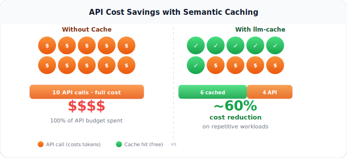
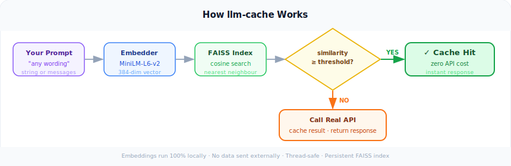
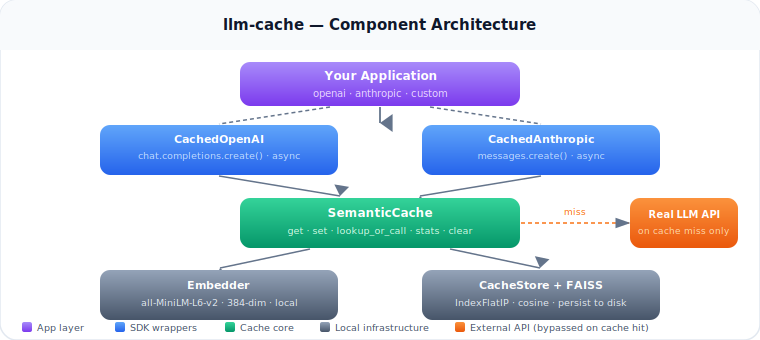

# llm-cache

[](https://heyneo.com)

[](https://marketplace.visualstudio.com/items?itemName=NeoResearchInc.heyneo)

Middleware library that caches LLM responses by **semantic similarity** — not exact string match.

If you send the same question twice with slightly different wording, it returns the cached answer instead of making a new API call. Uses a local FAISS index and sentence-transformers. No external services. No API keys required for the cache itself.

**Typical savings: 40–60% of API costs on repetitive workloads.**



---

## How it works



```
Your prompt
    │
    ▼
Embedder (all-MiniLM-L6-v2, runs locally)
    │   produces 384-dim vector, L2-normalised
    ▼
FAISS IndexFlatIP (cosine similarity via inner product)
    │   finds nearest cached prompt
    ▼
Similarity ≥ threshold?
    ├─ YES → return cached response  (zero API cost)
    └─ NO  → call real API → cache result → return response
```

- **Embeddings** are computed locally — no external service, no internet required after the model is downloaded.
- **FAISS** does exact nearest-neighbour search. Fast even with hundreds of thousands of entries.
- **Cosine similarity** via L2-normalised inner product: scores range 0–1.
- **Thread-safe**: all store operations use `threading.RLock`.
- **Persistence**: the FAISS index and a pickle file of metadata are written to `~/.llm_cache/` on every 10 writes (configurable).

---

## Architecture



---

## Install

```bash
pip install faiss-cpu sentence-transformers openai anthropic
pip install -e .
```

> The sentence-transformers model (`all-MiniLM-L6-v2`, ~90 MB) is downloaded automatically on first use and cached locally.

---

## Quick Start

### OpenAI — drop-in replacement

```python
# Before
from openai import OpenAI
client = OpenAI(api_key="sk-...")

# After — one line change
from llm_cache import CachedOpenAI
client = CachedOpenAI(api_key="sk-...", threshold=0.90)

# Usage is identical
response = client.chat.completions.create(
    model="gpt-4o",
    messages=[{"role": "user", "content": "What is the capital of France?"}]
)
print(response.choices[0].message.content)

# This hits the cache — no API call made
response2 = client.chat.completions.create(
    model="gpt-4o",
    messages=[{"role": "user", "content": "Tell me the capital city of France"}]
)
print(response2.choices[0].message.content)   # same answer, zero cost

# Check how much you've saved
stats = client.get_stats()
print(f"Hit rate: {stats['hit_rate']:.1%}  |  Hits: {stats['hits']}  |  Misses: {stats['misses']}")
```

### Anthropic — drop-in replacement

```python
# Before
from anthropic import Anthropic
client = Anthropic(api_key="sk-ant-...")

# After — one line change
from llm_cache import CachedAnthropic
client = CachedAnthropic(api_key="sk-ant-...", threshold=0.90)

# Usage is identical
response = client.messages.create(
    model="claude-3-5-sonnet-20241022",
    max_tokens=1024,
    messages=[{"role": "user", "content": "Explain photosynthesis"}]
)
print(response.content[0].text)

# Paraphrase — hits cache
response2 = client.messages.create(
    model="claude-3-5-sonnet-20241022",
    max_tokens=1024,
    messages=[{"role": "user", "content": "How does photosynthesis work in plants?"}]
)
print(response2.content[0].text)   # same answer, zero cost
```

### Async support

```python
from llm_cache import AsyncCachedOpenAI, AsyncCachedAnthropic

client = AsyncCachedOpenAI(api_key="sk-...")
response = await client.chat.completions.create(
    model="gpt-4o",
    messages=[{"role": "user", "content": "Hello"}]
)

client = AsyncCachedAnthropic(api_key="sk-ant-...")
response = await client.messages.create(
    model="claude-3-5-sonnet-20241022",
    max_tokens=512,
    messages=[{"role": "user", "content": "Hello"}]
)
```

### Use the cache directly (no LLM client needed)

```python
from llm_cache import SemanticCache

cache = SemanticCache(threshold=0.90, cache_name="my_project")

# Store any response (dict, string, object — anything picklable)
cache.set("What is the capital of France?", {"answer": "Paris"})

# Exact match
result = cache.get("What is the capital of France?")
# → {"answer": "Paris"}

# Paraphrase — still hits
result = cache.get("What city is the capital of France?")
# → {"answer": "Paris"}

# Unrelated — miss
result = cache.get("How do I bake bread?")
# → None

# Wrap any callable
def call_llm():
    return my_llm_client.generate("What is the capital of France?")

result = cache.lookup_or_call("What is the capital of France?", call_llm)
# Calls the LLM only on first invocation; returns cached result after that

# Stats
stats = cache.stats()
# {
#   "hits": 2,
#   "misses": 1,
#   "hit_rate": 0.667,
#   "total_entries": 1,
#   "threshold": 0.90
# }
```

---

## Run the demos (no API key required)

Both demos run entirely with mock responses so you can see the cache working immediately:

```bash
python examples/openai_example.py
python examples/anthropic_example.py
```

Expected output shows `[CACHE HIT]` / `[CACHE MISS]` labels and a final stats block with hit rate.

---

## Configuration

| Parameter | Default | Description |
|-----------|---------|-------------|
| `threshold` | `0.95` | Cosine similarity required for a cache hit (0–1). `0.90` is a good starting point for most workloads. Lower = more aggressive caching. |
| `cache_name` | `"default"` | Namespace for the on-disk cache. Use different names for different projects. |
| `cache_dir` | `~/.llm_cache` | Directory where the FAISS index and metadata are stored. |
| `persist` | `True` | Save cache to disk so it survives restarts. Set `False` for in-memory only. |
| `embedding_model` | `all-MiniLM-L6-v2` | sentence-transformers model used for embeddings. |

**Choosing a threshold:**

| Threshold | Behaviour |
|-----------|-----------|
| `0.98–1.0` | Near-exact matches only |
| `0.92–0.97` | Clear paraphrases ("What is X?" / "Explain X") |
| `0.88–0.91` | Looser rewording — good for most batch workloads |
| `< 0.85` | Aggressive — risk of false positives |

```python
# Persistent named cache — survives restarts
cache = SemanticCache(
    threshold=0.90,
    cache_name="product_descriptions",
    cache_dir="/data/llm_cache",
    persist=True,
)

# In-memory only — useful for testing or short-lived jobs
cache = SemanticCache(threshold=0.90, persist=False)
```

---

## Limitations

- **Streaming not cached.** Calls with `stream=True` are passed through to the real API unchanged.
- **Tool/function calls not cached.** If the model uses tools the response is still passed through; caching structured tool responses is on the roadmap.
- **Model-agnostic.** The cache key is the semantic content of the prompt, not the model name. Two different models answering the same question will share a cache entry by default. Separate this by using different `cache_name` values per model.
- **Picklable responses only.** The response object must be serialisable with `pickle`. Real SDK responses from `openai` and `anthropic` are picklable; custom objects might not be.

---

## Cache management

```python
from llm_cache import SemanticCache

cache = SemanticCache(cache_name="my_project")

# Find similar cached entries without threshold filtering
entries = cache.get_similar("What is ML?", k=5)
for e in entries:
    print(f"  score={e['similarity']:.3f}  text={e['text'][:60]}")

# Delete a specific entry by ID
entry_id = entries[0]["id"]
cache.delete(entry_id)

# Wipe everything
cache.clear()

# Force-save to disk
cache.save()

# Full stats
print(cache.stats())
```

---

## Project structure

```
llm_cache/
├── cache.py          # SemanticCache — main entry point
├── embedder.py       # Embedder — sentence-transformers wrapper with LRU cache
├── store.py          # CacheStore — FAISS index + persistent metadata
├── utils.py          # format_prompt, serialize/deserialize helpers
└── wrappers/
    ├── openai_wrapper.py     # CachedOpenAI, AsyncCachedOpenAI
    └── anthropic_wrapper.py  # CachedAnthropic, AsyncCachedAnthropic

examples/
├── openai_example.py     # Demo — no API key required
└── anthropic_example.py  # Demo — no API key required

tests/
├── test_cache.py
├── test_openai_wrapper.py
└── test_anthropic_wrapper.py
```

---

## Run tests

```bash
pip install pytest
pytest tests/ -v
```

---

## Built with NEO

This project was built **fully autonomously** using [NEO — Your Autonomous AI Agent](https://heyneo.com).

NEO can build complete, production-ready software projects like this one end-to-end: writing the library, tests, examples, documentation, and infographics — all from a single prompt.

Try NEO in your editor:

[](https://marketplace.visualstudio.com/items?itemName=NeoResearchInc.heyneo)
